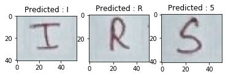

# Handwritten-Character-Recognition
Handwritten character recognition using keras. The model provided can also be used as a baseline model for applying transfer learning to attain better accuracy.

## Installing Requirements
    pip install -r requirements.txt

## Pretrained Models

Pretrained Model trained on [EMNIST](https://www.nist.gov/node/1298471/emnist-dataset) dataset is present inside the *[models](https://github.com/srijan14/handwritten-character-recognition/tree/master/models)* folder

The provided model achieves a **testing accuracy** of **92.43%**

## Train

   Put the .mat file downloaded from the EMINST page inside data folder.
   
   Training Parameters can be changed inside the **src/constants.py**
   
   Also the model architecture can be changes from inside **src/define_mode.py**
   
    python src/train.py  --data ./data/emnist-byclass.mat --start_from ./models/model.h5 
    
    --data : path of the training data(.mat format)
    --start_from : path of the pretrained models, to resume the training from pretrained model 
    
## Prediction

To make a prediction on a test image:

    python src/predict.py --data ./data/test/test.jpg--model ./models/model.h5
    
    --model :  path of the trained model
    --data  :  path of the image to make prediction on

   

# Test

To evaluate the model on test data

    python src/test.py --model models/model.h5 --data ./data/emnist-byclass.mat
    
    --model : path of the trained model
    --data  : path of the mat file
